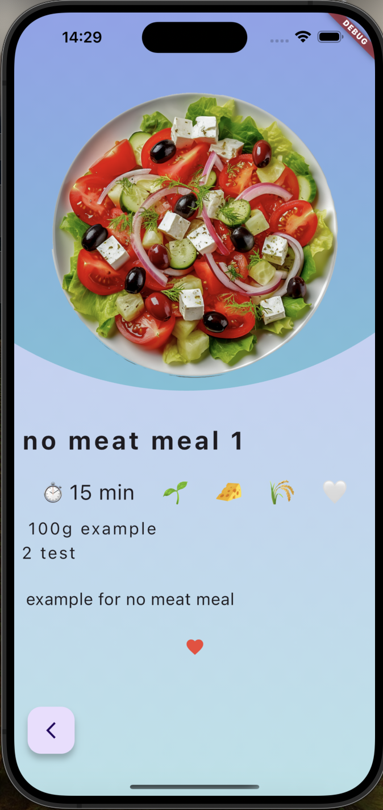

# Flutter-Django Projekt

Dies ist ein Showcase-Projekt, das Flutter für das Frontend und Django für das Backend verwendet. Diese Anleitung hilft Ihnen, das Projekt lokal auszuführen und zu testen.

## Inhaltsverzeichnis
1. [Projektübersicht](#projektübersicht)
2. [Voraussetzungen](#voraussetzungen)
3. [Installation](#installation)
4. [Projekt ausführen](#projekt-ausführen)
    - [Backend](#backend)
    - [Frontend](#frontend)
5. [Daten hinzufügen](#daten-hinzufügen)
6. [Screenshots](#screenshots)
7. [Kontakt](#kontakt)

## Projektübersicht

Kurze Beschreibung Ihres Projekts.

## Voraussetzungen

Stellen Sie sicher, dass die folgenden Voraussetzungen erfüllt sind:

- Python 3.x
- Django
- Flutter SDK

## Installation

Folgen Sie diesen Schritten, um das Projekt lokal zu installieren.

1. Klonen Sie das Repository:
    ```sh
    git clone https://github.com/IhrBenutzername/IhrProjekt.git
    ```
2. Navigieren Sie in das Projektverzeichnis:
    ```sh
    cd IhrProjekt
    ```

## Projekt ausführen

### Backend

1. Migration synchronisieren:
    ```sh
    python3 manage.py makemigrations
    python3 manage.py migrate
    ```

2. Server starten:
    ```sh
    python3 manage.py runserver
    ```

### Frontend

1. Flutter App starten:
    ```sh
    flutter run
    ```

## Daten hinzufügen

1. Server starten und zum Admin-Panel navigieren:
    - Navigieren Sie zu [localhost:8000/admin](http://localhost:8000/admin)
2. Admin-Zugangsdaten eingeben:
    - **Benutzername:** `admin`
    - **Passwort:** `admin`
3. Daten hinzufügen / bearbeiten / löschen

## Screenshots




